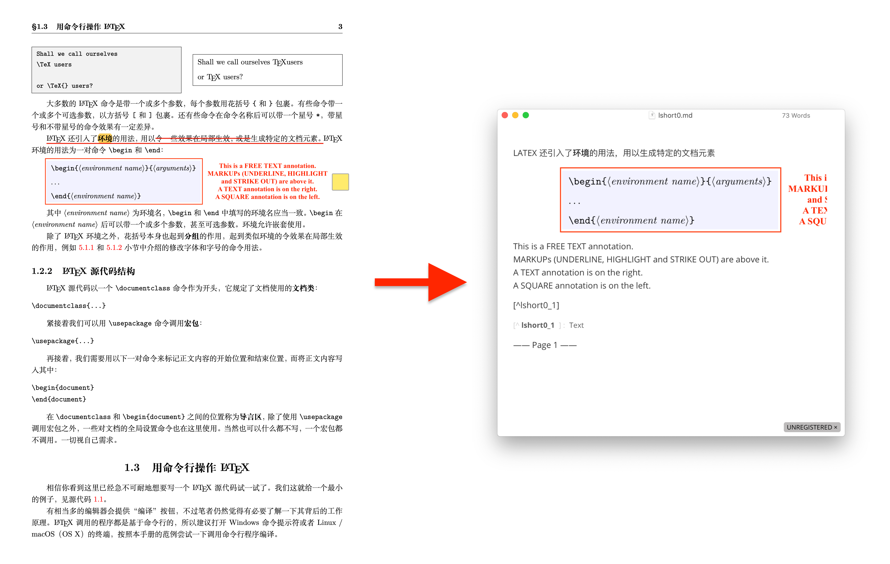

# AnnoDown

将 PDF 上的批注导出为 Markdown 文件。Python 开发，基于 [PyMuPDF](https://pymupdf.readthedocs.io/en/latest/#) 。

## 功能

将 PDF 上的批注导出为 Markdown 文件。目前支持的批注类型如下：

1. 文字标注 Markups (包括 highlight, underline, strike out 三种类型)：
   - Highlight 类型的批注提取为**加粗文本**。
   - Underline 类型的批注提取为普通文本。
   - Strike out 类型将被删除。
2. 矩形 Squares：若矩形标注无填充色，提取为区域截图。
3. 自由文本 Freetext：提取为普通文本。
4. 注释 Text：提取为脚注。



## 环境

Python 3.8.13，基于 [PyMuPDF](https://pymupdf.readthedocs.io/en/latest/#) 。

```
pip install pymupdf=1.20.1
```

## 使用方法

在系统命令行中运行：

```commandline
python <AnnoDown.py Path> <PDF Path>
```

使用

```commandline
python <AnnoDown.py Path> --help
```

查看其他可选参数的作用。

## 已知问题

1. PDF 不兼容的问题。没有 OCR。若 PDF 本身的文字**不可复制或复制为乱码**，也就无法提取 Markup。 
2. 提取 Markup 不准确的问题。开头和末尾的标点符号（字符面积较小）可能会漏掉。